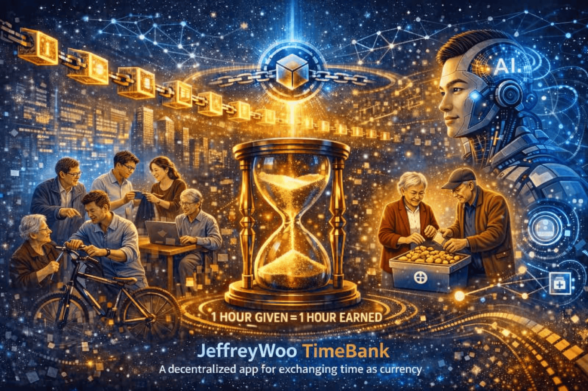
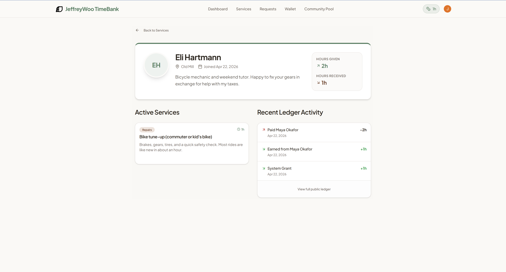
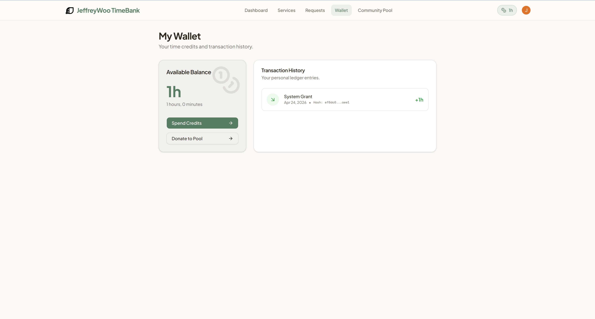
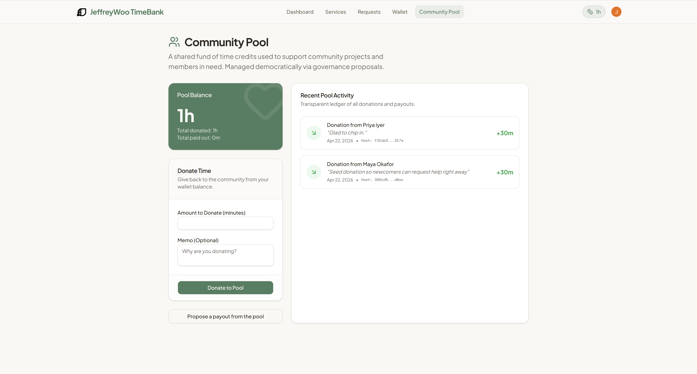
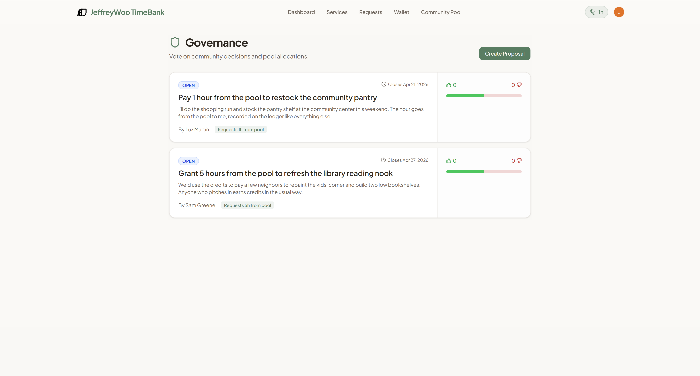
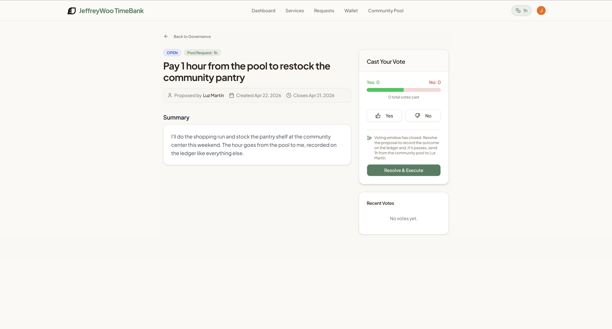

<div align="center">
  
</div>

## 📊 Overview
         
> **Not your typical community exchange app!**

**JeffreyWoo TimeBank** is a decentralized, AI-powered timebanking DApp that enables communities to exchange skills, services, and care using time credits as currency. Built on a blockchain-inspired, hash-chained ledger, every transaction is cryptographically linked, tamper-resistant, and publicly verifiable — ensuring trust without intermediaries.  

AI-driven matching intelligently connects neighbors by skills and needs, fostering collaboration across generations and professions. The principle is simple yet powerful: **1 hour given = 1 hour earned**. By combining transparent ledger technology with adaptive AI, it transforms volunteering into a sustainable, equitable ecosystem where time itself becomes the foundation of community value.

## ✨ What It Does

🤝 **Community Time Exchange** — trade time and skills directly with others through smart contracts  
🧠 **AI Matching Engine** — intelligently connects users based on skill profiles, availability, and community needs  
🔗 **Blockchain Transparency** — ensures secure, immutable records of time transactions  
🌍 **Global & Local Integration** — supports Hong Kong community exchanges while connecting to global timebank networks  
🔒 **Digital Identity & Trust Layer** — verifies participants via decentralized identity (DID) and reputation scoring

## 💡 Social Impact

This project demonstrates how technology can reshape community collaboration by:  
- Empowering individuals to value time equally, regardless of profession or income
- Building trust through transparent, decentralized time exchange
- Encouraging social inclusion and intergenerational cooperation
- Promoting sustainable community development through equitable resource sharing
- Integrating AI to optimize skill matching and time utilization

## 🚀 Why Choose JeffreyWoo TimeBank

Most apps focus on money. **JeffreyWoo TimeBank** focuses on time — the most universal currency.
It merges AI intelligence with blockchain fairness, creating a new way to exchange value that’s human-centered, transparent, and future-ready.

## 🧩 Core Concepts

|Concept	| Description|
|---------|------------|
|Time as Currency	| Every hour of service equals one hour of credit, regardless of skill type|
|Smart Contracts	| Automate time transactions securely on the blockchain|
|AI Skill Matching	| Suggests optimal exchanges based on user profiles and community demand|
|Decentralized Identity (DID)	| Builds trust through verifiable digital identities|
|Community Analytics	| Tracks engagement, contribution, and social impact metrics|

## 🏗️ System Architecture Overview
<pre lang="markdown">
               ┌───────────────────────────┐
               |   User Interface (React)  |
               |   TypeScript Frontend     |
               └───────────────────────────┘
                            ↓
               ┌───────────────────────────┐
               |   Frontend Logic          |
               |   State Mgmt / API Calls  |
               └───────────────────────────┘
                             |
           ┌───────────────────────────────────┐
           ↓                                   ↓
    ┌────────────────┐          ┌───────────────────────────┐
    | Smart Contracts|          | AI Matching Engine        |
    | (Solidity)     |          | Gemini API / GPT-4o       |
    |                |          | (Pluggable AI Model APIs) |
    └────────────────┘          └───────────────────────────┘
            ↓                                  ↓
┌───────────────────────────┐   ┌───────────────────────────┐
| Blockchain Network        |   | Skill & Profile Database  |
| Ethereum / Polygon        |   | PostgreSQL / Redis        |
| (Configured chain)        |   |                           | 
└───────────────────────────┘   └───────────────────────────┘
            ↓                                  ↓
┌───────────────────────────┐   ┌───────────────────────────┐
| Transaction Ledger        |   | Community Analytics       |
| Immutable Records         |   | Dashboards & Insights     |
└───────────────────────────┘   └───────────────────────────┘</pre>

## 🤖 Tech Stack

- **Language:** TypeScript, HTML
- **Framework:** React (Next.js optional)
- **Backend:** Node.js + FastAPI (for AI integration)
- **Blockchain:** Ethereum / Polygon (Smart Contracts via Solidity)
- **AI Models:** Gemini API, ChatAnywhere GPT 4o ca
- **Database:** PostgreSQL, Redis
- **UI:** Tailwind CSS + Recharts + Framer Motion

## 📦 Getting Started

1.	Clone the repository
    ```
  	git clone `https://github.com/wcfjeffrey/jeffreywoo-timebank-dapp.git  
    cd jeffreywoo-timebank-dapp
    ```
3.	Install dependencies  
    `npm install`
4.	Set up environment variables  
    Create .env.local and add your keys:  
    ```
    GEMINI_API_KEY=your_api_key_here
    BLOCKCHAIN_NETWORK=polygon
    ```
6.	Run the app  
    `npm run dev`

## 🧠 Sample


 
 

 
 

 
 

 
 

 
 
 
*Note: Both earn and spend time credits transparently through the DApp. AI recommends future matches based on skill compatibility and community needs.*

## ⚖️ Disclaimer

**JeffreyWoo TimeBank** is a conceptual decentralized application created for **educational, research, and community development purposes only**. It is not intended to function as a financial product, investment vehicle, or regulated service. The platform does not issue, trade, or guarantee monetary assets, and any time credits exchanged within the system are purely illustrative and non‑financial. Use of this project should be understood as experimental and exploratory, without any implication of financial return, legal enforceability, or commercial offering.

## 📄 License

**GNU Affero General Public License v3.0 (AGPL‑3.0)** — JeffreyWooFinance 

- ✅ You are free to use, modify, and distribute this software, provided that any derivative works are also licensed under AGPL‑3.0.
- ✅ If you run or deploy this software over a network (e.g., as a web service), you must make the source code of your modified version available to all users who interact with it.
- ✅ This ensures transparency, collaboration, and continued open‑source availability of improvements.
- ❌ The software is provided “as is”, without warranties of any kind.

For full details, see the [LICENSE](./LICENSE) file.

## 👤 About the Author
Jeffrey Woo — Finance Manager | Strategic FP&A, AI Automation & Cost Optimization | MBA | FCCA | CTA | FTIHK | SAP Financial Accounting (FI) Certified Application Associate | Xero Advisor Certified

📧 Email: jeffreywoocf@gmail.com  
💼 LinkedIn: https://www.linkedin.com/in/wcfjeffrey/  
🐙 GitHub: https://github.com/wcfjeffrey/
