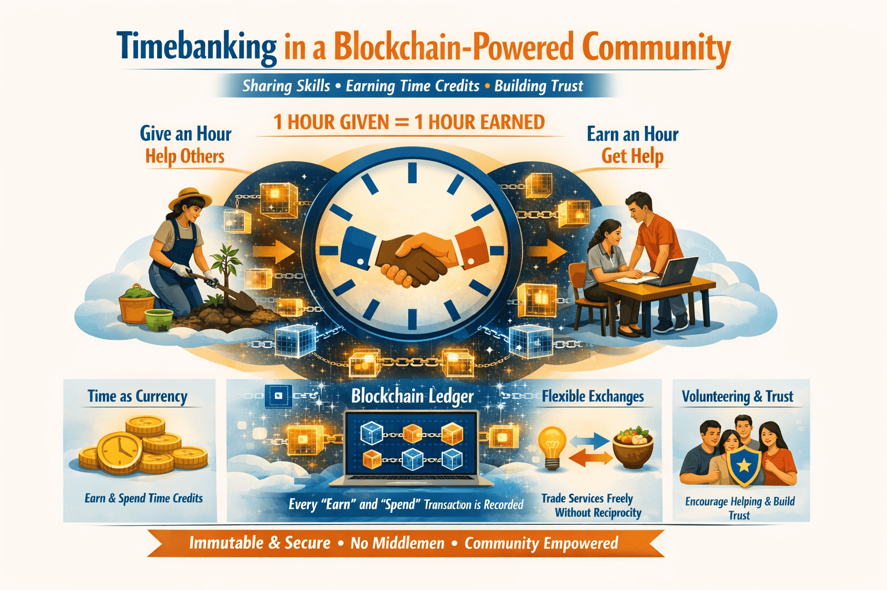
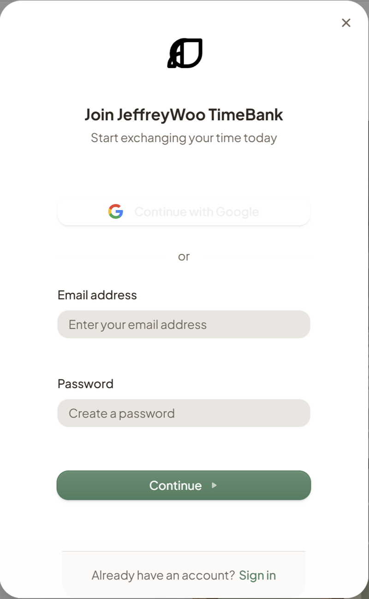
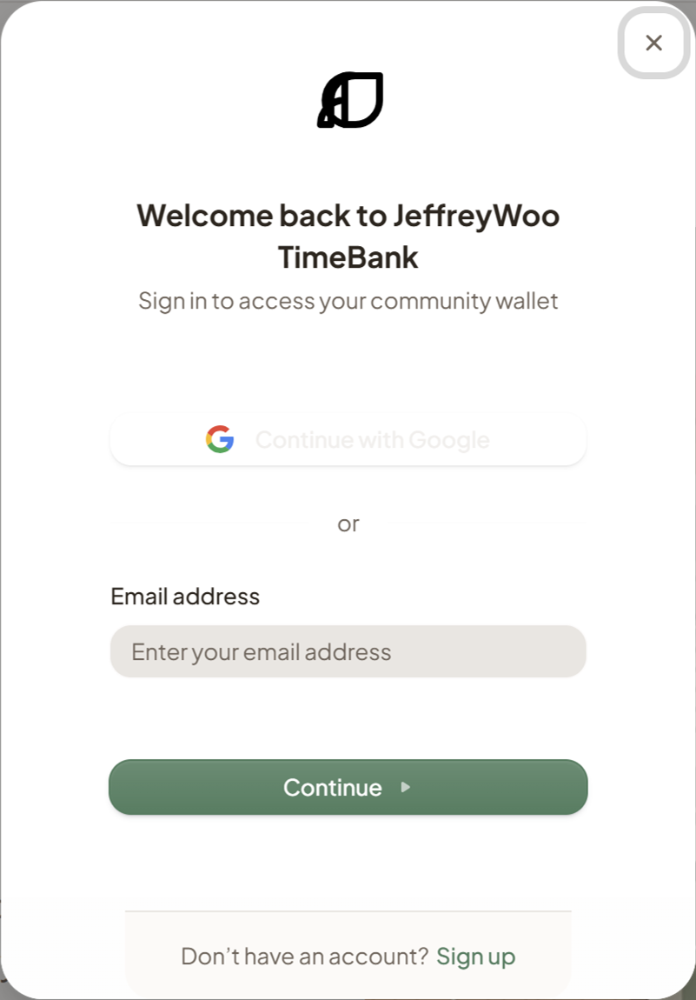
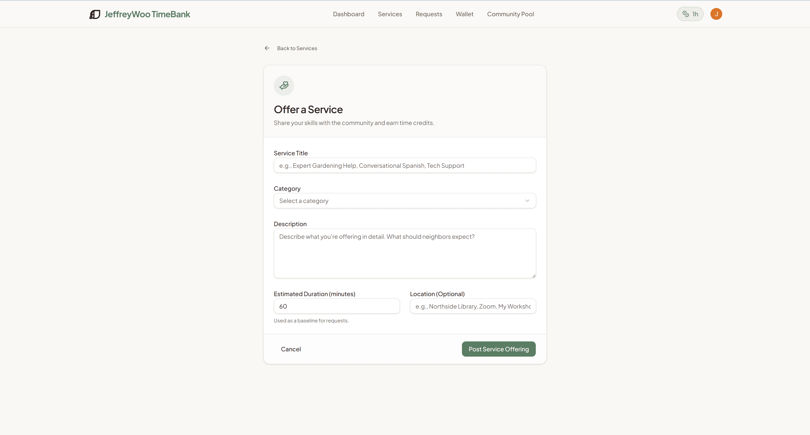
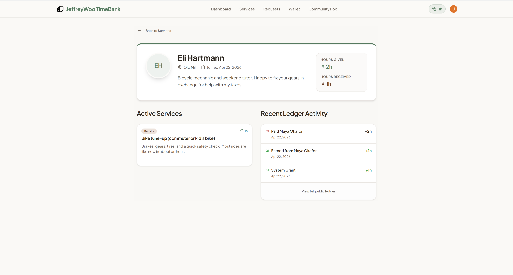
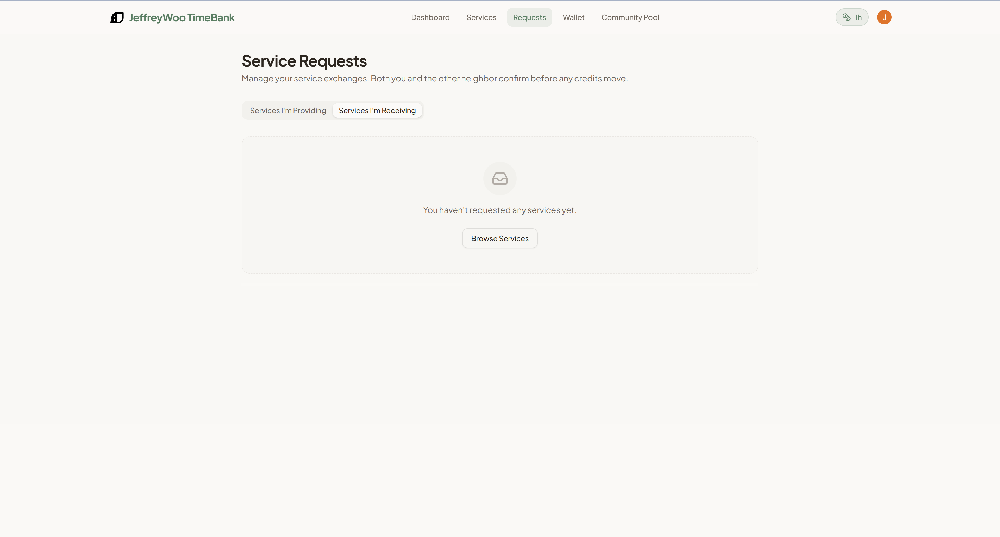
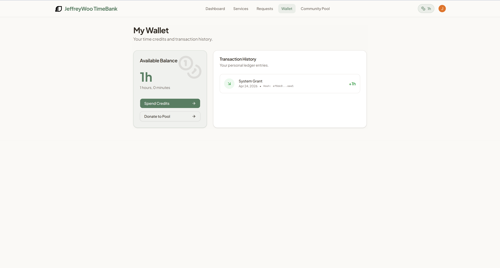
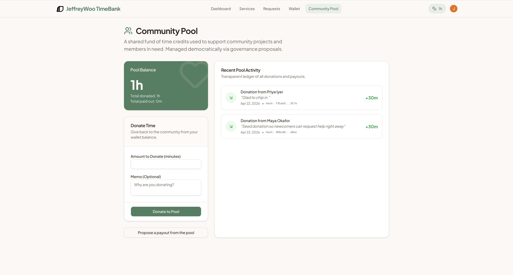
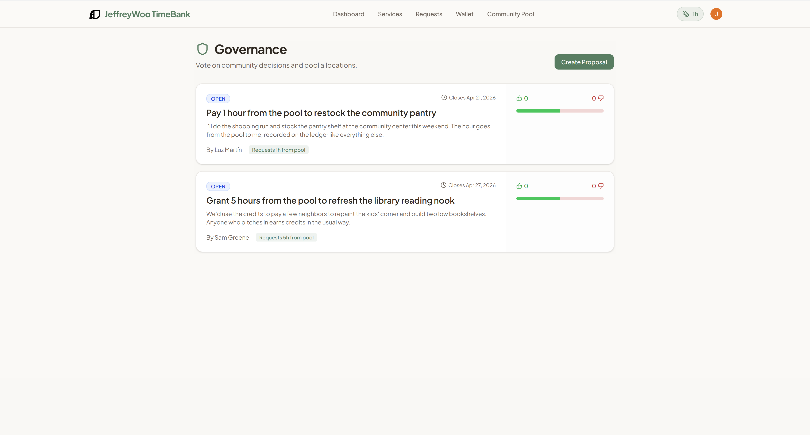

<div align="center">
  
</div>


-3C3C3D?style=for-the-badge&logo=ethereum&logoColor=white)
-8247E5?style=for-the-badge&logo=polygon&logoColor=white)
-F16822?style=for-the-badge&logo=web3.js&logoColor=white)
-363636?style=for-the-badge&logo=solidity&logoColor=white)
-2563EB?style=for-the-badge)
-F59E0B?style=for-the-badge)

## 📊 Overview
         
> **Not your typical community exchange app!**

**JeffreyWoo TimeBank** is a decentralized-by-design, blockchain‑inspired, AI-powered timebanking DApp that enables communities to exchange skills, community care services, and support using time credits as currency (**TimeCoins**). Built on a hash-chained ledger, every transaction is cryptographically linked, tamper-evident, and publicly verifiable — ensuring trust without requiring traditional intermediaries.

Decentralization is achieved through: the cryptographic hash chain itself. No single party can alter transaction history without detection, as every record is mathematically linked to the one before it. The ledger's integrity is distributed across cryptographic proofs rather than centralized authority — making trust a property of the data, not the operator.

AI-driven matching, powered by **Gemini API and GPT-4o**, intelligently connects neighbors by skills and needs, fostering collaboration across generations and professions. The principle is simple yet powerful: **1 hour given = 1 hour earned**.

By combining a decentralized, tamper-proof ledger with adaptive AI, JeffreyWoo TimeBank transforms volunteering into a sustainable, equitable ecosystem where time itself becomes the foundation of community value — creating a transparent record of care that anyone can audit, verify, and trust.

## ❤️ United Nations (UN) Sustainable Development Goals (SDGs)

The UN Conference on Sustainable Development (Rio+20) developed a series of Sustainable Development Goals (SDGs), emphasizing that people are at the core of sustainable development. It is committed to promoting sustainable and inclusive economic growth, social development, and environmental protection for the benefit of all humanity.

One of the major global social development challenges today is the "aging society." JeffreyWoo TimeBank aims to enhance the health and well-being of elderly and disabled individuals, reduce the burden on young caregivers, and support sustainable social development.

The SDGs were officially adopted by all member states in 2015. The 17 SDGs are linked to five critical areas: People, Planet, Prosperity, Peace, and Partnership.

Among them, the following SDGs are relevant to individuals with disabilities in this project:  

| SDG | UN Link | Focus | Activities |
|-----|------|-------|------------|
| SDG 1 | <a href="https://sdgs.un.org/goals/goal1"></a> | No Poverty | Assist in caring for the health of disabled individuals through activities such as medical escort support, and peer companionship. |
| SDG 2 | <a href="https://sdgs.un.org/goals/goal2"></a> | Zero Hunger | Provide daily meals and support for low-income disabled individuals through activities such as caregiver tea gathering assistant. |
| SDG 3 | <a href="https://sdgs.un.org/goals/goal3"></a> | Good Health and Well-being | Provide physical and mental health care services for disabled individuals through activities such as accompanied medical visits. |
| SDG 4 | <a href="https://sdgs.un.org/goals/goal4"></a> | Quality Education (Lifelong Learning) | Train volunteers in various disability care skills through activities such as sharing sessions, volunteer training, and interest/exercise class assistant. |
| SDG 5 | <a href="https://sdgs.un.org/goals/goal5"></a> | Gender Equality | Reduce the burden on primary caregivers in disabled individuals' families (often women) and recognize their contributions to caring for disabled family members. |

## 🤝 Example: Main Community Care Services of Association of Rehabilitation and Mutual Support (ARMS) — SDG Alignment Matrix

| Main Community Care Services | SDG 1<br/>No Poverty | SDG 2<br/>Zero Hunger | SDG 3<br/>Good Health and<br/>Well-being | SDG 4<br/>Quality Education<br/>(Lifelong Learning) | SDG 5<br/>Gender Equality |
|---------------------------------|----------------------|-----------------------|----------------------------------------|--------------------------------------------------------------|---------------------------|
| Care & Concern Home Visits | | | ✓ | ✓ | ✓ |
| Peer Companionship | ✓ | | | ✓ | ✓ |
| Medical Escort Support | ✓ | | | ✓ | ✓ |
| Accompanied Medical Visits | ✓ | | ✓ | ✓ | ✓ |
| Caregiver Tea Gathering Assistance| ✓ | ✓ | ✓ | ✓ | ✓ |
| Travel Assistance | | | ✓ | ✓ | ✓ |
| Calligraphy Class Assistance | | | ✓ | ✓ | ✓ |
| Painting Class Assistance | | | ✓ | ✓ | ✓ |
| Handicraft Class Assistance | | | ✓ | ✓ | ✓ |
| Art Class Assistance | | | ✓ | ✓ | ✓ |
| Singing Class Assistance | | | ✓ | ✓ | ✓ |
| Exercise Class Assistance | | | ✓ | ✓ | ✓ |
| Gardening Class Assistance | | | ✓ | ✓ | ✓ |
| IT Class Assistance | | | ✓ | ✓ | ✓ |
| Wellness Healthy Steps | | | ✓ | ✓ | ✓ |
| Sharing Sessions | | | ✓ | ✓ | ✓ |
| Volunteer Training | | | ✓ | ✓ | ✓ |
| Community Outreach Activities | | | | ✓ | ✓ |
| Helping Members | | | ✓ | ✓ | ✓ |
| Helping Patients | | | ✓ | ✓ | ✓ |
| Rehabilitation Internship | | | | ✓ | ✓ |

## ⏰ Timebanking System



✨ **What It Does**

**JeffreyWoo TimeBank** is built on the principle that everyone’s time has equal value. It transforms community service into a transparent, trust‑based exchange system where time itself becomes the currency (TimeCoin). Members earn time credits (TimeCoins) by providing community care services, and spend or donate those credits to receive help or support others.

⏰ **Community Care Service Exchange**

Members offer their skills and community care services — drawing on examples from the SDG Alignment Matrix — and record the time spent helping others.

🤝	**Four Core Actions**

|Action	|Description|
|-------|-----------|
|Earn	|Each hour of community care service generates a one-time credit (1 hour = 1 TimeCoin) stored securely in the hash-chained ledger.|
|Spend	|Use earned TimeCoins to request services from other members.|
|Donate	|Contribute TimeCoins to community pools, charities, or individuals in need.|
|Pool Payout	|Facilitate payouts from community pools to support vulnerable members.|

> **Core Principle: 1 hour given = 1 hour earned — creating a continuous cycle of giving and receiving.**

♻️ **Flexible Reciprocity**

Exchanges don't need to be one‑to‑one. Members can give help to one person and receive help from another, fostering community collaboration and a continuous cycle of goodwill.

🧠 **AI Matching Engine**

Intelligently connects users based on skill profiles, availability, service history, and community demand using Gemini API and GPT-4o — helping members find the right helpers and opportunities faster.

🔗 **Blockchain Transparency (Hash-Chained Ledger)**

|Step	|Description|
|-----|-----------|
|**1. Transaction Entry**	|Each community care service exchange (e.g., tutoring, bike repair) is recorded as a row in the ledger with all relevant fields: Sender, Recipient, Minutes, Memo, Timestamp, etc.|
|**2. prevHash**	|The `prevHash` field stores the hash of the previous transaction's `entryHash`. This links each new record to the one before it, forming a continuous chain.|
|**3. entryHash**	|The `entryHash` is computed by concatenating the transaction's fields (ID, Index, Kind, From ID, From Name, To ID, To Name, Minutes, Memo, Related Service ID, Related Service Title, Created At, and `prevHash`), then hashed using SHA-256.|
|**4. Chain Integrity**	|Because each transaction depends on the hash of the previous one, altering any past record breaks the chain. This creates a tamper-evident, publicly verifiable ledger, similar to how blocks are linked in a blockchain.|

**Note:** Smart contracts are coming in the future migration to Ethereum/Polygon. Currently, no public blockchain, gas fees, cryptocurrency wallets, or smart contracts.

📊	**Live Ledger Viewer**

Anyone can view all transactions in real-time — see who earned, spent, or donated TimeCoins, verify hash chain integrity, and audit community impact transparently. No login required.

💰 **Time Credit Balances & Transaction History**

For time credit management, each member has a personal dashboard "Wallet" showing real-time TimeCoin balance, complete earn/spend/donate/pool payout history, and cryptographic transaction receipts including `entryHash` for personal audit verification.

>**Note:** This is a time credit dashboard, not a cryptocurrency wallet. No crypto, gas fees, or private keys required — simply log in with email/password.

🔒 **Digital Identity & Trust**

|Aspect	|Current	|Future|
|-------|---------|------|
|Authentication	|Email/Password	|Verifiable Decentralized Identity (DID)|
|Reputation	|Profile-based	|Automated reputation scoring|

🌍 **Local & Global Integration**
Currently supports community exchanges with a focus on Hong Kong's social care needs (aligned with UN SDGs). Future roadmap includes connecting to global timebank networks and enabling cross-community interoperability.

## 💡Finance Transformation Impact

|Transformation Area	|Traditional Finance Challenge	|How This DApp Demonstrates Transformation	|Finance Implication|
|---------------------|-------------------------------|-------------------------------------------|-------------------|
|**Trust & Intermediaries**	|Manual reconciliations, audit costs, reliance on banks/third parties	|Hash-chained ledger (SHA-256) with `prevHash`/`entryHash` enables public verifiability without intermediaries	|Reduces audit fees, eliminates reconciliation overhead, automates trust for intercompany transactions|
|**Value Tokenization**	|Fiat-based incentives, delayed recognition, limited flexibility	|Tokenized time credits (1 hour = 1 TimeCoin) with Earn/Spend/Donate/Pool Payout mechanics	|Demonstrates tokenomics understanding for Web3 finance, employee rewards, and cross-border value transfer|
|**Financial FP&A**	|Reactive reporting, manual forecasting, static budgets	|AI-powered demand prediction and skill matching (Gemini API / GPT-4o)	|Enables dynamic forecasting, working capital optimization, and data-driven strategic planning|
|**Audit & Control**	|Periodic audits, sample-based testing, fraud detection lag	|Cryptographic linkage breaks chain if any transaction is altered — tamper-evident by design	|Mirrors continuous auditing, real-time control monitoring, and forensic accounting principles|
|**Reporting & Transparency**	|Month-end close cycles, static PDF reports, delayed stakeholder visibility	|Live ledger viewer with real-time updates, community impact dashboards, public transaction log	|Moves finance from periodic close to continuous close with real-time stakeholder dashboards|
|**Strategic Roadmap**	|Siloed systems, resistance to emerging tech	|Planned migration to **Solidity Smart Contracts on Ethereum/Polygon** with **ERC-20/ERC-721** tokenization and DAO governance	|Shows strategic foresight in DeFi integration, programmable money, and decentralized treasury management|

### Note: 

### ERC-20 vs. ERC-721: Comparison for JeffreyWoo TimeBank DApp

|Aspect|ERC-20 (Fungible Token)|ERC-721 (Non-Fungible Token / NFT)|
|------|-----------------------|----------------------------------|
|**Token Type**	|Fungible — every token is identical and interchangeable	|Non-fungible — each token is unique and non-interchangeable|
|**Analogy**	|Like dollars or hours — one hour equals any other hour	|Like a certificate or deed — each represents something unique|
|**Best For**	|Time credits / TimeCoins (currency-like)	|Service receipts, certifications, unique contributions|
|**Transferability**	|Any token can be split and transferred in any amount	|Each token is transferred as a whole unit (indivisible)|
|**Divisibility**	|Yes — can transfer 0.5, 0.25, or any decimal of a token	|No — tokens are indivisible (1 whole token only)|
|**Metadata**	|None (balance only)	|Rich metadata (service description, date, provider, recipient)|
|**Use Case in TimeBank**	|Daily time credit exchange (earn/spend/donate)	|Proof-of-service receipts, achievement badges, volunteer certifications|
|**Smart Contract Function**	|`transfer(from, to, amount)`	|`safeTransferFrom(from, to, tokenId)`|
|**Balance Tracking**	|`balanceOf(address)` returns a number	|`balanceOf(address)` returns count of unique tokens owned|
|**Gas Efficiency**	|Lower gas cost per transaction	|Higher gas cost per mint/transfer|

## 🤝 Social Impact

This project demonstrates how blockchain-inspired ledger technology can reshape community collaboration by:  
- **Empowering individuals** to value time and care equally, regardless of profession or income — with every hour cryptographically recorded and publicly verifiable on an immutable ledger
- **Building trust and social connection** across neighborhoods through transparent, decentralized time exchange — where hash-chained records eliminate the need for central authorities or intermediaries
- **Encouraging volunteering, mutual aid, social inclusion, and intergenerational cooperation** — backed by a tamper-evident blockchain-style audit trail that ensures fairness and accountability
- **Promoting sustainable community development** through equitable resource sharing — with every transaction cryptographically linked, preventing fraud or manipulation of time credits
- **Integrating AI** to optimize skill matching and time utilization — while the underlying hash chain ensures all matches and exchanges are permanently recorded and verifiable
- **Enabling members to donate time** to support vulnerable groups — with blockchain transparency ensuring donations reach intended recipients and can be audited by anyone

## 🚀 Why Choose JeffreyWoo TimeBank

Most apps focus on money. **JeffreyWoo TimeBank** focuses on time — the most universal currency.
It merges AI intelligence with blockchain fairness, creating a new way to exchange value that’s human-centered, transparent, and future-ready.

## 🧩 Core Concepts

|Concept	| Description|
|---------|------------|
|**Time as Currency**	|Every hour of community care service equals one hour of time credit (1 hour = 1 TimeCoin), regardless of skill type. Time is the most universal and equitable currency.|
|**Hash-Chained Ledger**	|Transactions are cryptographically linked using SHA-256 hashes (`prevHash` → `entryHash`), creating an immutable, tamper-evident chain without requiring a public blockchain. Every record is publicly verifiable.|
|**AI Skill Matching**	|Leverages Gemini API and GPT-4o to intelligently connect community members based on their skills, availability, service history, and community demand — optimizing time credit circulation.|
|**Four Transaction Types**	|The ledger supports four core operations: Earn (receive credits for service), Spend (use credits to receive help), Donate (contribute credits to community pools), and Pool Payout (distribute pooled credits to those in need).|
|**Cryptographic Integrity**	|Each transaction stores a `prevHash` (hash of the previous transaction) and an entryHash (hash of its own data + `prevHash`). Any alteration to past records breaks the chain, enabling tamper detection without central oversight.|
|**Community Analytics**	|Tracks engagement metrics, time credit circulation, service supply/demand patterns, and social impact — with AI-powered insights to help communities optimize resource allocation.|
|**Personal Time Ledger**	|Each member has a private dashboard "Wallet" showing real-time TimeCoin balance, full earn/spend/donate/pool payout history, and cryptographic transaction hashes — enabling personal financial accountability.|
|**Decentralized Identity (DID) — Future**	|Planned integration of verifiable digital identities and reputation scoring to build trust across communities without central authority.|
|**Smart Contracts — Future**	|Planned migration to Solidity on Ethereum/Polygon will automate time transactions, enable ERC-20/ERC-721 TimeCoin tokens, and support DAO-based governance for community rules and dispute resolution.|

## 🏗️ System Architecture Overview — Current State
<pre lang="markdown">
┌─────────────────────────────────────────────────────────────────────────────────────┐
│                              PRESENTATION LAYER                                     │
│  ┌───────────────────────────────────────────────────────────────────────────────┐  │
│  │                         User Interface (React)                                │  │
│  │                           TypeScript Frontend                                 │  │
│  │                      (Tailwind CSS / Framer Motion)                           │  │
│  │                                                                               │  │
│  │  ┌─────────────────┐  ┌─────────────────┐  ┌─────────────────────────────┐    │  │
│  │  │  Service Browse │  │  Ledger Viewer  │  │  Profile & Dashboard        │    │  │
│  │  │  & Request      │  │  (Live Updates) │  │  (Credits Balance)          │    │  │
│  │  └─────────────────┘  └─────────────────┘  └─────────────────────────────┘    │  │
│  └───────────────────────────────────────────────────────────────────────────────┘  │
└─────────────────────────────────────────────────────────────────────────────────────┘
                                              │
                                              ▼
┌─────────────────────────────────────────────────────────────────────────────────────┐
│                               APPLICATION LAYER                                     │
│  ┌───────────────────────────────────────────────────────────────────────────────┐  │
│  │                         Frontend Logic Layer                                  │  │
│  │                    (State Management / API Calls)                             │  │
│  └───────────────────────────────────────────────────────────────────────────────┘  │
│                                              │                                      │
│              ┌───────────────────────────────┼───────────────────────────────┐      │
│              ▼                               ▼                               ▼      │
│  ┌───────────────────────┐   ┌───────────────────────────┐   ┌─────────────────────┐│
│  │   AI Matching Engine  │   │    Backend & API Layer    │   │  User & Identity    ││
│  │                       │   │  (Node.js / Express.js)   │   │     Management      ││
│  │ ┌───────────────────┐ │   │                           │   │                     ││
│  │ │ Gemini API /      │ │   │  ┌─────────────────────┐  │   │ ┌─────────────────┐ ││
│  │ │ GPT-4o-ca         │ │   │  │ REST / GraphQL API  │  │   │ │ Basic User Auth │ ││
│  │ └───────────────────┘ │   │  └─────────────────────┘  │   │ │ (Email/Password)│ ││
│  │                       │   │                           │   │ └─────────────────┘ ││
│  │ ┌───────────────────┐ │   │  ┌─────────────────────┐  │   │ ┌─────────────────┐ ││
│  │ │ Skill-Based       │ │   │  │ WebSocket Gateway   │  │   │ │ Profile Storage │ ││
│  │ │ Matching          │ │   │  │ (Real-time ledger   │  │   │ │ (PostgreSQL)    │ ││
│  │ └───────────────────┘ │   │  │  updates)           │  │   │ └─────────────────┘ ││
│  └───────────────────────┘   │  └─────────────────────┘  │   └─────────────────────┘│
│                              └───────────────────────────┘                          │
└─────────────────────────────────────────────────────────────────────────────────────┘
                                              │
                                              ▼
┌─────────────────────────────────────────────────────────────────────────────────────┐
│                              DATA & STORAGE LAYER                                   │
│                                                                                     │
│  ┌───────────────────────────────────────────────────────────────────────────────┐  │
│  │                         Off-Chain Storage                                     │  │
│  │                                                                               │  │
│  │  ┌─────────────────────────┐         ┌─────────────────────────────────────┐  │  │
│  │  │       PostgreSQL        │         │              Redis                  │  │  │
│  │  │                         │         │                                     │  │  │
│  │  │  ┌─────────────────────┐│         │  ┌───────────────────────────────┐  │  │  │
│  │  │  │  User Profiles      ││         │  │  Session Cache                │  │  │  │
│  │  │  │  • Basic info       ││         │  └───────────────────────────────┘  │  │  │
│  │  │  │  • Skills offered   ││         │                                     │  │  │
│  │  │  │  • Reputation       ││         │  ┌───────────────────────────────┐  │  │  │
│  │  │  └─────────────────────┘│         │  │  Real-time Ledger Cache       │  │  │  │
│  │  │                         │         │  └───────────────────────────────┘  │  │  │
│  │  │  ┌─────────────────────┐│         └─────────────────────────────────────┘  │  │
│  │  │  │  Service Listings   ││                                                  │  │
│  │  │  │  • Title/Desc       ││                                                  │  │
│  │  │  │  • Duration         ││                                                  │  │
│  │  │  │  • Provider         ││                                                  │  │
│  │  │  └─────────────────────┘│                                                  │  │
│  │  └─────────────────────────┘                                                  │  │
│  └───────────────────────────────────────────────────────────────────────────────┘  │
│                                              │                                      │
│                                              ▼                                      │
│  ┌───────────────────────────────────────────────────────────────────────────────┐  │
│  │                    TRANSACTION LEDGER TABLES (Core Feature)                   │  │
│  │                                                                               │  │
│  │  ┌─────────────┐  ┌─────────────┐  ┌─────────────┐  ┌─────────────────────┐   │  │
│  │  │    EARN     │  │    SPEND    │  │   DONATE    │  │    POOL PAYOUT      │   │  │
│  │  │   Table     │  │   Table     │  │   Table     │  │      Table          │   │  │
│  │  ├─────────────┤  ├─────────────┤  ├─────────────┤  ├─────────────────────┤   │  │
│  │  │ • id        │  │ • id        │  │ • id        │  │ • id                │   │  │
│  │  │ • user_id   │  │ • from_id   │  │ • from_id   │  │ • pool_id           │   │  │
│  │  │ • minutes   │  │ • to_id     │  │ • to_id     │  │ • recipient_id      │   │  │
│  │  │ • timestamp │  │ • minutes   │  │ • minutes   │  │ • minutes           │   │  │
│  │  │ • service   │  │ • timestamp │  │ • timestamp │  │ • timestamp         │   │  │
│  │  │   id        │  │ • service   │  │ • pool_id   │  │ • reason            │   │  │
│  │  │ • memo      │  │   id        │  │ • memo      │  │ • approved_by       │   │  │
│  │  └─────────────┘  │ • memo      │  └─────────────┘  └─────────────────────┘   │  │
│  │                   └─────────────┘                                             │  │
│  │                                                                               │  │
│  │  ┌─────────────────────────────────────────────────────────────────────────┐  │  │
│  │  │              Hash-Chained Linkage (Cryptographic Integrity)             │  │  │
│  │  │                                                                         │  │  │
│  │  │   Each transaction stores:                                              │  │  │
│  │  │   • prevHash  → Hash of the previous transaction's entryHash            │  │  │
│  │  │   • entryHash → SHA-256(concatenated transaction fields + prevHash)     │  │  │
│  │  │                                                                         │  │  │
│  │  │   [Record 1] ──hash──→ [Record 2] ──hash──→ [Record 3] ──hash──→ ...    │  │  │
│  │  │   (prevHash=0)         (prevHash=H1)        (prevHash=H2)               │  │  │
│  │  └─────────────────────────────────────────────────────────────────────────┘  │  │
│  └───────────────────────────────────────────────────────────────────────────────┘  │
└─────────────────────────────────────────────────────────────────────────────────────┘
                                              │
                                              ▼
┌─────────────────────────────────────────────────────────────────────────────────────┐
│                           BLOCKCHAIN-INSPIRED LAYER                                 │
│                                                                                     │
│  ┌───────────────────────────────────────────────────────────────────────────────┐  │
│  │                    Hash-Chained Ledger Implementation                         │  │
│  │                              (Current)                                        │  │
│  │                                                                               │  │
│  │  ┌─────────────────────────────────────────────────────────────────────────┐  │  │
│  │  │                      Cryptographic Verification                         │  │  │
│  │  │                                                                         │  │  │
│  │  │   • Tamper-evident chain                                                │  │  │
│  │  │   • Public verifiability                                                │  │  │
│  │  │   • No external blockchain required                                     │  │  │
│  │  │   • Trust without intermediaries                                        │  │  │
│  │  └─────────────────────────────────────────────────────────────────────────┘  │  │
│  │                                                                               │  │
│  │  ┌─────────────────────────────────────────────────────────────────────────┐  │  │
│  │  │                    1 Hour Given = 1 Hour Earned                         │  │  │
│  │  │                    (Time Credit/Time Coin Rule)                         │  │  │
│  │  └─────────────────────────────────────────────────────────────────────────┘  │  │
│  └───────────────────────────────────────────────────────────────────────────────┘  │
└─────────────────────────────────────────────────────────────────────────────────────┘
                                              │
                                              ▼
┌─────────────────────────────────────────────────────────────────────────────────────┐
│                              ANALYTICS & INSIGHTS LAYER                             │
│                                                                                     │
│  ┌───────────────────────────────────────────────────────────────────────────────┐  │
│  │                         Community Analytics Platform                          │  │
│  │                                                                               │  │
│  │  ┌─────────────────┐  ┌─────────────────┐  ┌─────────────────────────────────┐│  │
│  │  │  Live Ledger    │  │  User Activity  │  │  Community Impact               ││  │
│  │  │  Viewer         │  │  Dashboard      │  │  • Total hours exchanged        ││  │
│  │  │  • All Txns     │  │  • Credits      │  │  • Active members               ││  │
│  │  │  • Hash chain   │  │    balance      │  │  • Services offered             ││  │
│  │  │  • Public log   │  │  • Tx history   │  │  • Pool donations               ││  │
│  │  └─────────────────┘  └─────────────────┘  └─────────────────────────────────┘│  │
│  │                                                                               │  │
│  │  ┌─────────────────┐  ┌─────────────────┐  ┌─────────────────────────────────┐│  │
│  │  │  AI-Powered     │  │  Skill Demand   │  │  Personalized                   ││  │
│  │  │  Recommendations│  │  Analytics      │  │  Matching Suggestions           ││  │
│  │  │  • Next actions │  │  • Popular      │  │  • Based on skills              ││  │
│  │  │  • Skill match  │  │    services     │  │  • Based on history             ││  │
│  │  └─────────────────┘  └─────────────────┘  └─────────────────────────────────┘│  │
│  └───────────────────────────────────────────────────────────────────────────────┘  │
└─────────────────────────────────────────────────────────────────────────────────────┘</pre>

## ⭐ Finance Skills Strengthened

|Skill Category	|Specific Skill	|How the DApp Demonstrated It|
|---------------|---------------|----------------------------|
|**Financial Systems**	|General Ledger Architecture	|Designed Earn/Spend/Donate/Pool Payout tables — analogous to GL, sub-ledgers, and contra accounts|
|**Internal Controls**	|Audit Trail Design	|Implemented cryptographic `prevHash` → `entryHash` linkage making tampering immediately detectable|
|**Tokenomics**	|Digital Asset Economics	|Created time-based token economy with issuance, circulation, donation, and pool payout mechanics (1 hour = 1 TimeCoin)|
|**FP&A**	|Predictive Forecasting	|Integrated AI demand forecasting to anticipate service needs — directly applicable to rolling forecasts and scenario planning|
|**Process Automation**	|Workflow Automation	|Automated time credit issuance, transfer, verification, and balance updates — similar to invoice processing or payroll accruals|
|**Data Integrity**	|Reconciliation Design	|Hash chain ensures altering any transaction breaks all subsequent links — analogous to bank reconciliation and intercompany matching|
|**Smart Contracts**	|Programmable Finance	|Planned Solidity functions (earn/spend/donate/poolPayout) demonstrate understanding of automated treasury and DeFi protocols|
|**Stakeholder Reporting**	|Dashboard Design	|Built live ledger viewer with community impact metrics — equivalent to board-level KPIs and balanced scorecards|
|**Digital Transformation**	|Process Re-engineering	|Reimagined traditional timebanking with blockchain-inspired + AI layers — showing ability to lead finance tech transformation|
|**Project Management**	|Cross-Functional Integration	|Project spans React frontend, Node.js backend, Gemini AI, PostgreSQL database — mirroring ERP implementation leadership|
|**Risk Management**	|Control Design	|Built tamper-evident ledger to prevent fraud without central authority — analogous to designing fraud prevention frameworks|
|**Change Management**	|Adoption Strategy	|Designed public verifiable ledger to build community trust without mandatory central control — applicable to ERP or new system rollout|

## 🤖 Tech Stack

- **Language:** TypeScript, HTML
- **Framework:** React
- **Runtime:** Node.js
- **Framework:** Express (REST API)
- **Validation:**	Zod (with drizzle-zod)
- **Database ORM:**	Drizzle ORM
- **Database:** PostgreSQL
- **Cache:** Redis
- **AI Models:** Gemini API, ChatAnywhere GPT 4o ca
- **API Codegen:** Orval
- **UI:** Tailwind CSS + Recharts + Framer Motion
- **Blockchain:**	Ethereum / Polygon (future development)
- **Smart Contracts:** Solidity (future development)

## 🔍 Data Validation with Zod

| Function | How Zod Works in This DApp |
|----------|---------------------------|
| **Define data shapes** | Schemas define exact API requirements: Service Title ≥ 3 characters, Estimated Minutes 15-1440, Donation Minutes ≥ 15, Query Limit ≤ 200 |
| **Validate API requests** | Automatically checks request bodies against schemas — rejects invalid inputs before any business logic runs |
| **Validate API responses** | Ensures the backend never returns malformed or unexpected data to the frontend |
| **Ensure data integrity** | Prevents corrupt transaction data (negative minutes, invalid categories, malformed hashes) from entering the time credit ledger |

## 🧠 AI Techniques Applied

Artificial Intelligence is integrated into **JeffreyWoo TimeBank** to make time exchanges smarter, fairer, and more efficient. While the ledger ensures transparency and trust, AI adds intelligence to the way communities connect and collaborate.

|Key Application|Description|
|----------------|-----------|
|**Skill & Need Matching**|AI analyzes participant profiles, skills, and availability to recommend optimal exchanges — ensuring that time credit (TimeCoin) flow where they are most valuable.|
|**Community Insights**|Machine learning models detect patterns in service demand and supply, helping communities anticipate needs (e.g., tutoring spikes before exams, caregiving demand during holidays).|
|**Personalized Recommendations**|AI suggests opportunities for participants based on their past contributions, reputation, and preferences — encouraging ongoing engagement.|
|**Trust & Reputation Scoring**|AI evaluates contribution history and feedback to generate reputation scores, strengthening accountability and reducing the risk of misuse.|
|**Scalability Across Communities**|AI enables interoperability between local timebanks, predicting cross‑community exchanges and fostering global collaboration.|

## 🔗 Blockchain & Ledger Techniques Applied

**JeffreyWoo TimeBank** leverages a **blockchain‑inspired, hash-chained ledger** architecture inside its PostgreSQL database to ensure trust, transparency, accountability, immutability, and verifiability in time credit (TimeCoin) exchanges — all within a traditional database. This design makes it ideal for community adoption while demonstrating core Web3 principles.

> **Note:** Currently no public blockchain (**Ethereum or Polygon**), gas fees, cryptocurrency wallets, or **Smart Contracts**.

### 🔐 Hash-chained Ledger Flow

<pre lang="markdown">
┌─────────────────────────────────────────────────────────────────┐
│                    HASH-CHAINED LEDGER FLOW                     │
├─────────────────────────────────────────────────────────────────┤
│                                                                 │
│   [Record 1]          [Record 2]          [Record 3]            │
│   ┌─────────┐         ┌─────────┐         ┌─────────┐           │
│   │  Data   │         │  Data   │         │  Data   │           │
│   │ Fields  │         │ Fields  │         │ Fields  │           │
│   └────┬────┘         └────┬────┘         └────┬────┘           │
│        │                   │                   │                │
│        ▼                   ▼                   ▼                │
│   entryHash_A        entryHash_B        entryHash_C             │
│   (SHA-256)          (SHA-256)          (SHA-256)               │
│        │                   │                   │                │
│        └─────────┬─────────┘                   │                │
│                  │                             │                │
│            prevHash_B ─────────────────────────┘                │
│            (= entryHash_A)                                      │
│                                                                 │
│   ⛓️ Tampering any record breaks all subsequent hashes          │
│   👁️ Anyone can verify the entire chain                         │
│   🏛️ Trust without intermediaries                               │
│                                                                 │
└─────────────────────────────────────────────────────────────────┘</pre>

**Note:** For a detailed walkthrough of the `prevHash`/`entryHash` calculation, see the below *Blockchain Mechanism Illustrated by a Ledger Example*.

### 📊 Core Features

|Core Feature	|Description|
|-------------|-----------|
|**Hash‑Chained Transactions**	|Every transaction stores the hash of the previous transaction (`prevHash`) and its own hash (`entryHash`), creating a tamper-evident chain similar to Bitcoin's blockchain.|
|**Public Verifiability**	|Anyone can download the ledger data and cryptographically verify the entire chain's integrity — ensuring community trust without requiring centralized intermediaries.|
|**No Intermediaries for Trust**	|Trust becomes a property of the mathematical proof, not a server administrator. The ledger is tamper-evident by design.
|**Time Credits as Currency**	|Each hour of community care service provided equals one hour earned (1 hour = 1 TimeCoin). Credits circulate freely, enabling flexible exchanges across the community.|
|**AI‑Enhanced Matching**	|AI algorithms (Gemini API, GPT-4o) connect participants by skills and needs, ensuring efficient and equitable distribution of time credits.|
|**Decentralized Identity & Reputation (Future)**	|Planned integration of verifiable digital identities and reputation scores built from contribution history.|

### 💡 Why This Architecture Matters
|Principle	|What It Means	|Finance Analogy|
|-----------|---------------|---------------|
|**Tamper-Evidence**	|Altering any record breaks all subsequent hashes — tampering is immediately detectable	|Continuous auditing — fraud detected instantly, not after periodic review|
|**Public Verifiability**	|Anyone can audit the full transaction history without permission	|Open-book accounting — stakeholders verify independently|
|**Trust Without Intermediaries**	|No bank, broker, or central authority needed to validate transactions	|Trustless reconciliation — counterparties don't need to trust each other|
|**Immutable Audit Trail**	|Complete, unalterable history of every time credit exchange	|Forensic accounting ready — perfect for regulatory review|

## 🪙 System Architecture Overview — Future State (with Roadmap Integration)
<pre lang="markdown">
┌─────────────────────────────────────────────────────────────────────────────────────┐
│                              PRESENTATION LAYER                                     │
│  ┌───────────────────────────────────────────────────────────────────────────────┐  │
│  │                         User Interface (React)                                │  │
│  │                           TypeScript Frontend                                 │  │
│  │                      (Tailwind CSS / Framer Motion)                           │  │
│  └───────────────────────────────────────────────────────────────────────────────┘  │
└─────────────────────────────────────────────────────────────────────────────────────┘
                                              │
                                              ▼
┌─────────────────────────────────────────────────────────────────────────────────────┐
│                               APPLICATION LAYER                                     │
│  ┌───────────────────────────────────────────────────────────────────────────────┐  │
│  │                         Frontend Logic Layer                                  │  │
│  │                    (State Management / API Calls)                             │  │
│  └───────────────────────────────────────────────────────────────────────────────┘  │
│                                              │                                      │
│              ┌───────────────────────────────┼───────────────────────────────┐      │
│              ▼                               ▼                               ▼      │
│  ┌───────────────────────┐   ┌───────────────────────────┐   ┌─────────────────────┐│
│  │   AI Matching Engine  │   │    Backend & API Layer    │   │  Decentralized      ││
│  │                       │   │   (Node.js / Express.js)  │   │  Identity (DID)     ││
│  │ ┌───────────────────┐ │   │                           │   │                     ││
│  │ │ Gemini API /      │ │   │  ┌─────────────────────┐  │   │ ┌─────────────────┐ ││
│  │ │ GPT-4o-ca         │ │   │  │ REST / GraphQL API  │  │   │ │ Verifiable      │ ││
│  │ └───────────────────┘ │   │  └─────────────────────┘  │   │ │ Digital IDs     │ ││
│  │ ┌───────────────────┐ │   │                           │   │ └─────────────────┘ ││
│  │ │ Demand/Supply     │ │   │  ┌─────────────────────┐  │   │ ┌─────────────────┐ ││
│  │ │ Prediction        │ │   │  │ WebSocket Gateway   │  │   │ │ Reputation      │ ││
│  │ │ (Real-time)       │ │   │  │ (Real-time updates) │  │   │ │ Scoring Engine  │ ││
│  │ └───────────────────┘ │   │  └─────────────────────┘  │   │ └─────────────────┘ ││
│  └───────────────────────┘   └───────────────────────────┘   └─────────────────────┘│
└─────────────────────────────────────────────────────────────────────────────────────┘
                                              │
                                              ▼
┌─────────────────────────────────────────────────────────────────────────────────────┐
│                              DATA & STORAGE LAYER                                   │
│  ┌───────────────────────────────────────────────────────────────────────────────┐  │
│  │                    Off-Chain Storage (Current + Caching)                      │  │
│  │  ┌─────────────────────────┐         ┌─────────────────────────────────────┐  │  │
│  │  │     PostgreSQL          │         │              Redis                  │  │  │
│  │  │  • User Profiles        │         │  • Session Management               │  │  │
│  │  │  • AI Match Cache       │         │  • Real-time Analytics Cache        │  │  │
│  │  │  • Analytics Data       │         │  • Rate Limiting                    │  │  │
│  │  └─────────────────────────┘         └─────────────────────────────────────┘  │  │
│  └───────────────────────────────────────────────────────────────────────────────┘  │
│                                              │                                      │
│                                              ▼                                      │
│  ┌───────────────────────────────────────────────────────────────────────────────┐  │
│  │                    TRANSACTION LEDGER TABLES (Logical Model)                  │  │
│  │                                                                               │  │
│  │  ┌─────────────┐  ┌─────────────┐  ┌─────────────┐  ┌─────────────────────┐   │  │
│  │  │    EARN     │  │    SPEND    │  │   DONATE    │  │    POOL PAYOUT      │   │  │
│  │  │  Table      │  │   Table     │  │   Table     │  │      Table          │   │  │
│  │  ├─────────────┤  ├─────────────┤  ├─────────────┤  ├─────────────────────┤   │  │
│  │  │ • user_id   │  │ • from_id   │  │ • from_id   │  │ • pool_id           │   │  │
│  │  │ • minutes   │  │ • to_id     │  │ • to_id     │  │ • recipient_id      │   │  │
│  │  │ • timestamp │  │ • minutes   │  │ • minutes   │  │ • minutes           │   │  │
│  │  │ • service   │  │ • timestamp │  │ • timestamp │  │ • timestamp         │   │  │
│  │  │   details   │  │ • service   │  │ • pool_id   │  │ • approval_hash     │   │  │
│  │  └─────────────┘  └─────────────┘  └─────────────┘  └─────────────────────┘   │  │
│  └───────────────────────────────────────────────────────────────────────────────┘  │
└─────────────────────────────────────────────────────────────────────────────────────┘
                                              │
                                              ▼
┌─────────────────────────────────────────────────────────────────────────────────────┐
│                            BLOCKCHAIN / SMART CONTRACT LAYER                        │
│                                    (Future)                                         │
│                                                                                     │
│  ┌───────────────────────────────────────────────────────────────────────────────┐  │
│  │                         SOLIDITY SMART CONTRACTS                              │  │
│  │                                                                               │  │
│  │  ┌─────────────────────────────────────────────────────────────────────────┐  │  │
│  │  │                      Core TimeBank Contract                             │  │  │
│  │  │  • timeCredits mapping (address => uint256)    // Balances "Table"      │  │  │
│  │  │  • earn() function                                                      │  │  │
│  │  │  • spend() function                                                     │  │  │
│  │  │  • donate() function                                                    │  │  │
│  │  │  • poolPayout() function                                                │  │  │
│  │  └─────────────────────────────────────────────────────────────────────────┘  │  │
│  │                                                                               │  │
│  │  ┌─────────────────────────────────────────────────────────────────────────┐  │  │
│  │  │                      Token Contract (ERC-20/ERC-721)                    │  │  │
│  │  │  • TimeCreditToken (ERC-20) for fungible time credits                   │  │  │
│  │  │  • ServiceNFT (ERC-721) for unique community care service offerings     │  │  │
│  │  └─────────────────────────────────────────────────────────────────────────┘  │  │
│  │                                                                               │  │
│  │  ┌─────────────────────────────────────────────────────────────────────────┐  │  │
│  │  │                      Event Logs (On-Chain History)                      │  │  │
│  │  │  event TimeEarned(address user, uint256 minutes, uint256 timestamp)     │  │  │
│  │  │  event TimeSpent(address from, address to, uint256 minutes, ...)        │  │  │
│  │  │  event TimeDonated(address from, address pool, uint256 minutes, ...)    │  │  │
│  │  │  event PoolPayout(address pool, address to, uint256 minutes, ...)       │  │  │
│  │  └─────────────────────────────────────────────────────────────────────────┘  │  │
│  └───────────────────────────────────────────────────────────────────────────────┘  │
│                                              │                                      │
│              ┌───────────────────────────────────────────────────────────┐          │
│              ▼                                                           ▼          │
│  ┌───────────────────────┐                                   ┌─────────────────────┐│
│  │   Polygon/Ethereum    │                                   │   Cross-Chain       ││
│  │      Network          │                                   │   Bridge            ││
│  │  (Mainnet / Testnet)  │                                   │   (Future)          ││
│  └───────────────────────┘                                   └─────────────────────┘│
└─────────────────────────────────────────────────────────────────────────────────────┘
                                              │
                                              ▼
┌─────────────────────────────────────────────────────────────────────────────────────┐
│                           INTEROPERABILITY & GOVERNANCE LAYER                       │
│                                    (Future)                                         │
│                                                                                     │
│  ┌───────────────────────────────────────────────────────────────────────────────┐  │
│  │                      Cross-Community Interoperability                         │  │
│  │  ┌─────────────────────────┐         ┌─────────────────────────────────────┐  │  │
│  │  │ Global Timebank Registry│         │  Cross-Border Exchange Protocol     │  │  │
│  │  │  • Community Discovery  │         │  • Atomic Swaps                     │  │  │
│  │  │  • Trust Scoring        │         │  • Exchange Rate Oracle             │  │  │
│  │  └─────────────────────────┘         └─────────────────────────────────────┘  │  │
│  └───────────────────────────────────────────────────────────────────────────────┘  │
│                                                                                     │
│  ┌───────────────────────────────────────────────────────────────────────────────┐  │
│  │                         DAO Governance Layer                                  │  │
│  │  ┌─────────────────────────┐         ┌─────────────────────────────────────┐  │  │
│  │  │  Governance Token       │         │  Voting Mechanism                   │  │  │
│  │  │  (Time Credit based)    │         │  • Proposal Creation                │  │  │
│  │  └─────────────────────────┘         │  • Quadratic Voting                 │  │  │
│  │                                      │  • Dispute Resolution               │  │  │
│  │  ┌─────────────────────────┐         └─────────────────────────────────────┘  │  │
│  │  │  Treasury Management    │                                                  │  │
│  │  │  • Community Fund       │                                                  │  │
│  │  │  • Upgrade Proposals    │                                                  │  │
│  │  └─────────────────────────┘                                                  │  │
│  └───────────────────────────────────────────────────────────────────────────────┘  │
└─────────────────────────────────────────────────────────────────────────────────────┘
                                              │
                                              ▼
┌─────────────────────────────────────────────────────────────────────────────────────┐
│                              ANALYTICS & INSIGHTS LAYER                             │
│                                                                                     │
│  ┌───────────────────────────────────────────────────────────────────────────────┐  │
│  │                         Community Analytics Platform                          │  │
│  │                                                                               │  │
│  │  ┌─────────────────┐  ┌─────────────────┐  ┌─────────────────────────────────┐│  │
│  │  │  Engagement     │  │  Impact         │  │  Demand Forecasting             ││  │
│  │  │  Dashboards     │  │  Metrics        │  │  • AI-powered predictions       ││  │
│  │  │  • Active users │  │  • Hours pooled │  │  • Skill gap analysis           ││  │
│  │  │  • Tx volume    │  │  • Communities  │  │  • Resource optimization        ││  │
│  │  └─────────────────┘  └─────────────────┘  └─────────────────────────────────┘│  │
│  │                                                                               │  │
│  │  ┌─────────────────┐  ┌─────────────────┐  ┌─────────────────────────────────┐│  │
│  │  │  Reputation     │  │  Network        │  │  Personalized                   ││  │
│  │  │  Leaderboard    │  │  Graph          │  │  Recommendations                ││  │
│  │  │  • Trust scores │  │  • Connections  │  │  • Skill matches                ││  │
│  │  │  • Badges       │  │  • Clusters     │  │  • Opportunity alerts           ││  │
│  │  └─────────────────┘  └─────────────────┘  └─────────────────────────────────┘│  │
│  └───────────────────────────────────────────────────────────────────────────────┘  │
└─────────────────────────────────────────────────────────────────────────────────────┘</pre>

**JeffreyWoo TimeBank** is currently a conceptual DApp built on a **blockchain‑inspired hash‑chained ledger**. Future development may extend this foundation into a fully deployed **Smart Contract** ecosystem. Planned directions include:

- **Smart Contract Deployment**

  - Implement core time credit logic in Solidity  
  - Deploy contracts to Ethereum or Polygon for transparent, verifiable exchanges

- **Tokenization of Time Credits**

  - Represent each hour of community care service as a transferable ERC‑20 or ERC‑721 token (1 hour = 1 TimeCoin)  
  - Enable interoperability with other decentralized applications

- **Decentralized Identity (DID) Integration**

  - Support verifiable digital identities for participants  
  - Build reputation scoring based on contribution history

- **AI‑Enhanced Matching Engine**

  - Expand skill‑matching algorithms with advanced AI APIs  
  - Optimize community exchanges by predicting demand and supply trends

- **Cross‑Community Interoperability**

  - Connect multiple local timebanks into a global network  
  - Enable cross‑border exchanges of time credits/TimeCoins

- **Governance & Data Access Object (DAO) Model**

  - Introduce community voting for rules, upgrades, and dispute resolution  
  - Ensure democratic participation in platform evolution

## 📈 Full Comparison Table: Current DApp vs. Future DApp

|Comparison Aspect	|Current DApp (Hash-Chained Ledger)	|Future DApp (Smart Contracts on Ethereum/Polygon)|
|-------------------|-----------------------------------|-------------------------------------------------|
|**🔹 CORE ARCHITECTURE**	|||	
|Ledger Type	|Hash-chained ledger in PostgreSQL	|On-chain ledger on Ethereum/Polygon|
|Transaction Storage	|Database rows with `prevHash`/`entryHash`	|Blockchain transactions with block hashes|
|Business Logic Location	|Node.js / Express.js backend	|Solidity Smart Contracts|
|Cryptographic Method	|SHA-256 for `entryHash`/`prevHash`	|SHA-256 + Consensus mechanism (PoS)|
|Trust Model	|Cryptographic proofs + trust community + server integrity	|Trust blockchain code + network consensus|
|**🔹 TIME COIN TOKEN**		|||
|Token Representation	|Database records (Earn/Spend/Donate tables)	|ERC-20 fungible token|
|Token Standard	|None (custom database schema)	|ERC-20 (or ERC-721 for unique community care services)|
|1 Hour = ?	|1 TimeCoin (database credit)	|1 TimeCoin (ERC-20 token)|
|Token Transfer	|Backend API updates database	|`transfer()` function on blockchain|
|Token Balance	|Query PostgreSQL	|Query blockchain state (mapping)|
|**🔹 TRANSACTION TYPES**		|||
|Earn Operation|	INSERT into `earn` table	|Call `earn()` function on Smart Contract|
|Spend Operation	|INSERT into `spend` table + update balances	|Call `spend()` or `transfer()` function|
|Donate Operation	|INSERT into `donate` table	|Call `donate()` function to pool address|
|Pool Payout	|INSERT into `pool_payout` table with approval	|Call `poolPayout()` via DAO vote + multi-sig|
|**🔹 SECURITY & INTEGRITY**		|||
|Tamper Evidence	|`prevHash`/`entryHash` chain breaks if altered	|Blockchain immutability + consensus|
|Auditability	|Manual SQL queries or ledger viewer	|Public block explorer (PolygonScan/EtherScan)|
|Fraud Prevention	|Manual hash chain verification/ledger viewer	|Smart Contract invariants + automatic consensus + block explorer|
|Centralization Risk	|Server can be compromised or shut down	|No central point of failure|
|Need for Audits	|Code audits for backend	|Smart Contract audits + formal verification|
|**🔹 COSTS & FEES**		|||
|Transaction Fee (Gas)	|❌ Free (no gas)	|✅ Required (MATIC or ETH)|
|Estimated Cost per Transaction (cast/earn/spend/donate TimeCoin)	|USD0	|~USD0.001 - USD0.01 (Polygon) / ~USD1-5 (Ethereum)|
|Deployment Cost	|❌ Not applicable	|~USD0.10 - USD0.50 (Polygon) / ~USD50-200 (Ethereum)|
|Monthly Operational Cost	|Server/hosting costs	|Gas costs + possible node fees|
|Storage Cost	|Very low (PostgreSQL storage)	|Very high (blockchain storage limited)|
|**🔹 PERFORMANCE**		|||
|Transaction Speed	|~10-100 milliseconds	|~5-30 seconds (Polygon) / ~12-15 seconds (Ethereum)|
|Transactions Per Second (TPS)	|Thousands (database capacity)	|~65 (Ethereum) / ~700 (Polygon)|
|Scalability	|High (add more database servers)	|Limited (L2 solutions needed)|
|Confirmation Finality	|Instant (server response)	|Multiple block confirmations needed|
|**🔹 USER EXPERIENCE**		|||
|Cryptocurrency Wallet Required	|❌ No (email/password login)	|✅ Yes (MetaMask, WalletConnect, etc.)|
|User Onboarding	|Simple (email signup)	|Complex (install cryptocurrency wallet, buy crypto)|
|Gas Fee Management	|❌ Not required	|✅ Users need MATIC/ETH for gas|
|Recovery Mechanism	|Standard password reset	|Seed phrase recovery (self-custody)|
|Mobile Accessibility	|Any browser	|Any browser + cryptocurrency wallet app|
|**🔹 DEVELOPMENT & MAINTENANCE**		|||
|Programming Languages	|TypeScript, JavaScript, Python, HTML/CSS	|Solidity + existing frontend languages|
|Smart Contract Language	|❌ None	|Solidity / Vyper|
|Development Framework	|React, Node.js, Express.js	|Hardhat / Truffle / Foundry + existing stack|
|Testing Difficulty	|Easy (unit tests, integration tests)	|Hard (forking mainnet, simulation, gas optimization)|
|Bug Fixes	|Easy (deploy new backend code)	|Very Hard (proxy pattern or new contract migration)|
|Deployment Process	|`git push` to server	|`npx hardhat deploy --network polygon`|
|Version Upgrades	|Seamless (overwrite code)	|Requires proxy contracts or contract migration|
|**🔹 INTEROPERABILITY**		|||
|Cross-Chain Support	|❌ Not applicable	|✅ Bridges (Polygon ↔ Ethereum ↔ other chains)|
|DeFi Integration	|❌ Not possible	|✅ Can integrate with exchanges, lending protocols|
|Cryptocurrency Wallet Integration	|❌ None	|✅ MetaMask, Coinbase Wallet, Rainbow, etc.|
|Block Explorer	|❌ None	|✅ PolygonScan / EtherScan|
|**🔹 GOVERNANCE**		|||
|Control Model	|Centralized (developer/admin)	|Decentralized (DAO with token voting)|
|Rule Changes	|Developer updates code	|Community votes on proposals|
|Dispute Resolution	|Admin intervention	|Smart Contract logic + DAO voting|
|Transparency Level	|High (source code open)	|Very High (code immutable on chain)|
|**🔹 COMPLIANCE & LEGAL**		|||
|KYC/AML Requirements	|Optional (community discretion)	|Required for regulated deployments|
|Data Privacy	|GDPR compliance possible	|Harder (data permanently on-chain)|
|Regulatory Status	|Educational / experimental	|May be regulated as financial service|
|**🔹 USE CASE SUITABILITY**		|||
|Small Community (<500 users)	|✅ Excellent	|⚠️ Overkill (costs unnecessary)|
|Large Community (>5,000 users)	|⚠️ Trust concerns may grow	|✅ Excellent|
|Educational / Prototype	|✅ Perfect	|⚠️ Too complex|
|Production / Mainnet	|⚠️ Possible with trust assumptions	|✅ Industry standard|
|Low Budget Project	|✅ Best choice	|❌ Gas costs add up|
|High-Value Transactions	|⚠️ Risk of server compromise	|✅ Strongest security|
|**🔹 ROADMAP STATUS**		|||
|Implementation Status	|✅ Fully implemented (current)	|🔮 Planned (future development)|
|Time to Implement	|Already complete	|~2-4 months|
|Estimated Effort	|—	|Medium to High|

## 🚚 System Migration Plan (future development)
<pre lang="markdown">
┌─────────────────────────────────────────────────────────────────────────────────────┐
│ PHASE 1: PREPARATION & AUDIT                                                        │
├─────────────────────────────────────────────────────────────────────────────────────┤
│ □ Audit existing hash-chain ledger data for integrity                               │
│ □ Export all transaction records (Earn/Spend/Donate/Pool Payout)                    │
│ □ Backup PostgreSQL database (users, services, transactions)                        │
│ □ Document backend business logic for Solidity migration                            │
│ □ Map database schema to smart contract data structures                             │
└─────────────────────────────────────────────────────────────────────────────────────┘
                                         │
                                         ▼
┌─────────────────────────────────────────────────────────────────────────────────────┐
│ PHASE 2: SMART CONTRACT DEVELOPMENT                                                 │
├─────────────────────────────────────────────────────────────────────────────────────┤
│ □ Write Solidity TimeCoinToken (ERC-20 for fungible time credits)                   │
│ □ Write Solidity ServiceNFT (ERC-721 for proof-of-service receipts)                 │
│ □ Write Solidity TimeBankCore (earn/spend/donate/poolPayout functions)              │
│ □ Implement proxy pattern for upgradeability (UUPS or Transparent)                  │
│ □ Write unit tests (Hardhat / Foundry) with 100% coverage goal                      │
│ □ Run security analysis (Slither, Mythril, static analysis)                         │
│ □ Perform formal verification for critical functions                                │
└─────────────────────────────────────────────────────────────────────────────────────┘
                                         │
                                         ▼
┌─────────────────────────────────────────────────────────────────────────────────────┐
│ PHASE 3: TESTNET DEPLOYMENT                                                         │
├─────────────────────────────────────────────────────────────────────────────────────┤
│ □ Deploy to Polygon Mumbai Testnet (lower gas for testing)                          │
│ □ Deploy to Ethereum Sepolia Testnet (higher security testing)                      │
│ □ Verify contracts on explorers (MumbaiScan / Sepolia Etherscan)                    │
│ □ Run integration tests with existing React frontend                                │
│ □ Perform user acceptance testing (UAT) with pilot community                        │
│ □ Test cryptocurrency wallet connections (MetaMask, WalletConnect, Coinbase Wallet) │
│ □ Conduct gas optimization and cost analysis                                        │
└─────────────────────────────────────────────────────────────────────────────────────┘
                                         │
                                         ▼
┌─────────────────────────────────────────────────────────────────────────────────────┐
│ PHASE 4: DATA MIGRATION                                                             │
├─────────────────────────────────────────────────────────────────────────────────────┤
│ □ Migrate user balances from PostgreSQL to ERC-20 token balances                    │
│ □ Migrate transaction history as verified on-chain events                           │
│ □ Validate hash-chain integrity (prevHash → entryHash links)                        │
│ □ Generate Merkle proofs for historical off-chain data                              │
│ □ Create audit report comparing legacy vs. migrated data                            │
│ □ Implement fallback mechanism for migration failures                               │
└─────────────────────────────────────────────────────────────────────────────────────┘
                                         │
                                         ▼
┌─────────────────────────────────────────────────────────────────────────────────────┐
│ PHASE 5: MAINNET DEPLOYMENT                                                         │
├─────────────────────────────────────────────────────────────────────────────────────┤
│ □ Deploy to Polygon Mainnet (recommended: lower gas, faster finality)               │
│ □ Alternative: Ethereum Mainnet (higher security, higher cost, slower)              │
│ □ Update frontend environment variables for Mainnet                                 │
│ □ Configure cryptocurrency wallet connectors for Mainnet networks                   │
│ □ Launch hybrid mode (off-chain PostgreSQL for off-chain data + on-chain tokens)    │
│ □ Deploy DAO governance contracts (voting, treasury, dispute resolution)            │
│ □ Execute final security audit by third-party firm                                  │
│ □ Go-live: Community announcement and onboarding guide                              │
└─────────────────────────────────────────────────────────────────────────────────────┘
                                         │
                                         ▼
┌─────────────────────────────────────────────────────────────────────────────────────┐
│ POST-MIGRATION (Future)                                                             │
├─────────────────────────────────────────────────────────────────────────────────────┤
│ □ Monitor Mainnet performance and gas costs                                         │
│ □ Implement cross-chain bridges (Polygon ↔ Ethereum ↔ other chains)                 │
│ □ Integrate with DeFi protocols (lending, yield farming for time credits)           │
│ □ Enable cross-community interoperability (global timebank network)                 │
│ □ Launch bug bounty program for smart contract security                             │
└─────────────────────────────────────────────────────────────────────────────────────┘</pre>

## 🔗 Reference Resources for System Migration

|Resource	|Link|
|---------|----|
|Hardhat Documentation	|https://hardhat.org/docs|
|OpenZeppelin Contracts	|https://docs.openzeppelin.com/contracts|
|Polygon Mumbai Faucet	|https://faucet.polygon.technology/|
|Ethereum Sepolia Faucet	|https://sepoliafaucet.com/|
|Remix IDE	|https://remix.ethereum.org/|

## 📦 Getting Started

1.	Clone the repository
    ```
  	git clone https://github.com/wcfjeffrey/jeffreywoo-timebank-dapp.git  
    cd jeffreywoo-timebank-dapp
    ```
    
2.	Install dependencies  
    `npm install`
  	
3.	Set up environment variables  
    Create .env.local and add your keys:  
    ```
    GEMINI_API_KEY=your_api_key_here
    BLOCKCHAIN_NETWORK=polygon
    ```
    
4.	Run the app  
    `npm run dev`

## 📋 Sample


### Sign Up to Join JeffreyWoo TimeBank Community  
 

### Secure Login to JeffreyWoo TimeBank  
 

### Live Ledger View (No Login Required)  


### ⛓️ Blockchain Mechanism Illustrated by a Ledger Example


Priya Iyer offers a 30‑minute portfolio + resume review for designers via video call.

The previous transaction’s hash is:  
- `prevHash`: 300cd5...d8ac  
- `entryHash` (computed): f31ab3...317e

#### Transaction Fields

|Field	|Value|
|-------|-----|
|ID	|tx2001|
|Index	|1|
|Kind	|GRANT|
|From ID	|user123|
|From Name	|Priya Iyer|
|To ID	|user789|
|To Name	|Designer Participant|
|Minutes	|30|
|Memo	|Portfolio + resume review|
|Related Service ID	|svc456|
|Related Service Title	|30-min video call feedback|
|Created At	|2026-04-22T10:00:00Z|
|prevHash	|300cd5...d8ac|

#### 1. Transaction A (prevHash: before Priya’s entry) (hash payload construction)

- Its fields are concatenated into a payload string.  
- SHA‑256 hashing produces `entryHash_A` = 300cd5...d8ac.  
  *Note: The **shortened display hash** (10 characters) is for **visual reference only**. All cryptographic verification — chain integrity, tamper detection, and hash linking — uses the **full 64-character hash** stored in the database.*
- 1 hour = 1 time credit, so `entryHash_A` has 15 minutes = 0.25 time credits = 0.25 TimeCoins

#### 2. Transaction B (entryHash_B: Priya’s entry) (hash computation)

- Includes `prevHash` = `entryHash_A`.  
- Concatenates all fields **including that `prevHash` into a new payload (single string)**.  
- Using **SHA‑256** to hash this payload produces `entryHash_B` = f31ab3...317e.
```
import crypto from "crypto";

function computeHash(data: string) {
  return crypto.createHash("sha256").update(data).digest("hex");
}

const payload = "tx2001|1|GRANT|user123|Priya Iyer|user789|Designer Participant|30|Portfolio + resume review|svc456|30-min video call feedback|2026-04-22T10:00:00Z|300cd5...d8ac";

const entryHash = computeHash(payload);
console.log(entryHash); // f31ab3...317e
```
- 1 hour = 1 time credit, so `entryHash_B` has 30 minutes = 0.5 time credits = 0.5 TimeCoins

#### 3. Dependency

- Priya’s `entryHash_B` is valid only if the `prevHash` matches the actual hash of the previous transaction.  
- If Transaction A were altered, its `entryHash_A` would change, breaking the link in Transaction B.

#### 4. Result

- **prevHash:** 300cd5...d8ac  (0.25 TimeCoins)
- **entryHash:** f31ab3...317e (0.5 TimeCoins)
- Priya Iyer has given a total of 45 minutes (0.75 TimeCoins = 0.25 + 0.5) to the community.
- Each entryHash locks in the previous transaction’s hash.
- This creates a hash‑chained ledger: TxA → TxB → TxC …
- Any tampering in earlier entries invalidates all subsequent hashes, ensuring immutability and transparency.

This demonstrates how Priya Iyer’s **30‑minute video call review** is cryptographically linked to the previous transaction. Any change in the fields (e.g., minutes, memo, or names) would alter the entryHash, breaking the chain and ensuring tamper‑evidence.

 
 

 
 

 
 

 
 

### Note: 

### Voting + Resolution Mechanism
<pre lang="markdown">
┌───────────────────────────────────────────────────────────────────┐
│PROPOSAL: Pay 1 hour from the pool to restock the community pantry │
│Proposed by: Luz Martín                                            │
│Created: Apr 22, 2026                                              │
│Closes: Apr 29, 2026                                               │
└───────────────────────────────────────────────────────────────────┘
                              │
                              ▼
┌───────────────────────────────────────────────────────────────────┐
│                     PHASE 1: VOTING ACTIVE                        │
│                                                                   │
│  ┌─────────────────────────────────────────────────────────┐      │
│  │  Status:      Voting Open                               │      │
│  │  Period:      Apr 22, 2026 → Apr 29, 2026 (7 days)      │      │
│  │  Community:   Cast votes (For / Against / Abstain)      │      │
│  │  Ledger:      Records each vote as transaction          │      │
│  └─────────────────────────────────────────────────────────┘      │
│                                                                   │
│  Vote Transaction Example:                                        │
│  ┌────────────┬──────────┬────────────┬─────────────────────┐     │
│  │ Kind       │ From     │ Proposal ID│ Vote                │     │
│  ├────────────┼──────────┼────────────┼─────────────────────┤     │
│  │ VOTE       │ Alice    │ #42        │ FOR                 │     │
│  │ VOTE       │ Bob      │ #42        │ AGAINST             │     │
│  │ VOTE       │ Carol    │ #42        │ ABSTAIN             │     │
│  └────────────┴──────────┴────────────┴─────────────────────┘     │
│                                                                   │
└───────────────────────────────────────────────────────────────────┘
                              │
                              ▼
┌───────────────────────────────────────────────────────────────────┐
│                  PHASE 2: VOTING CLOSED & RESOLVE                 │
│                                                                   │
│  ┌─────────────────────────────────────────────────────────┐      │
│  │  Trigger:     Apr 29, 2026 (after 23:59:59 UTC)         │      │
│  │  Action:      Call resolveProposal(#42)                 │      │
│  │  Check 1:     Voting window closed? ✓ Yes               │      │
│  │  Check 2:     Quorum reached? (e.g., 10% of total)      │      │
│  │  Check 3:     For votes > Against votes?                │      │
│  └─────────────────────────────────────────────────────────┘      │
│                                                                   │
│  Resolution Recorded on Ledger:                                   │
│  ┌────────────────┬─────────────────────────────────────────┐     │
│  │ Kind           │ PROPOSAL_RESOLVE                        │     │
│  │ Proposal ID    │ #42                                     │     │
│  │ Outcome        │ PASSED (or FAILED)                      │     │
│  │ Vote Tally     │ 45 For / 12 Against / 3 Abstain         │     │
│  │ Timestamp      │ Apr 29, 2026 00:00:01 UTC               │     │
│  └────────────────┴─────────────────────────────────────────┘     │
│                                                                   │
└───────────────────────────────────────────────────────────────────┘
                              │
                              ▼
┌───────────────────────────────────────────────────────────────────┐
│              PHASE 3: EXECUTION (IF PROPOSAL PASSES)              │
│                                                                   │
│  ┌─────────────────────────────────────────────────────────┐      │
│  │  Condition:   Proposal #42 PASSED                       │      │
│  │  Action:      Execute pool payout                       │      │
│  │  From:        Community Pool                            │      │
│  │  To:          Pantry Restocking Account                 │      │
│  │  Amount:      1 hour (60 minutes)                       │      │
│  │  Reason:      Restock community pantry                  │      │
│  └─────────────────────────────────────────────────────────┘      │
│                                                                   │
│  Execution Recorded on Ledger:                                    │
│  ┌────────────────┬─────────────────────────────────────────┐     │
│  │ Kind           │ POOL_PAYOUT                             │     │
│  │ From ID        │ community_pool_address                  │     │
│  │ To ID          │ pantry_restock_address                  │     │
│  │ Minutes        │ 60                                      │     │
│  │ Memo           │ Prop #42: Restock community pantry      │     │
│  │ Approved By    │ DAO Vote #42                            │     │
│  │ prevHash       │ (hash of previous PROPOSAL_RESOLVE tx)  │     │
│  │ entryHash      │ SHA-256(combined fields + prevHash)     │     │
│  │ Timestamp      │ Apr 29, 2026 00:00:05 UTC               │     │
│  └────────────────┴─────────────────────────────────────────┘     │
│                                                                   │
│  ✅ Community pantry restocked with 1 hour of time credits        │
│                                                                   │
└───────────────────────────────────────────────────────────────────┘</pre>
 
*Note: Both earn and spend/donate time credits transparently through the DApp. AI recommends future matches based on skill compatibility and community needs.*

## ⚖️ Legal & Regulatory Disclaimer (China & Hong Kong)

This section addresses the regulatory status of the term **"TimeBank"** in Mainland China and Hong Kong. **JeffreyWoo TimeBank** is a conceptual decentralized application created for **educational, research, and community development purposes only**. It is not intended to function as a financial product, investment vehicle, or regulated service. The platform does not issue, trade, or guarantee monetary assets, and any time credits exchanged within the system are purely illustrative and non‑financial. Use of this project should be understood as experimental and exploratory, without any implication of financial return, legal enforceability, or commercial offering.

### 📌 Important Notice on the Use of "TimeBank"

The name **"TimeBank"** is used in this project as a descriptive term for a community time exchange system — not as an indication of a licensed financial institution.

However, users should be aware of the following legal restrictions:

|Jurisdiction	|Restriction	|Implication for This DApp|
|-------------|-------------|-------------------------|
|Mainland China	|Unauthorized use of "Bank" in service names violates the Commercial Banking Law and CBIRC regulations	|Deployment in mainland China requires renaming (e.g., "Time Exchange Hub")|
|Hong Kong	|Section 97 of the Banking Ordinance (Cap. 155) prohibits non-banks from using "Bank" without HKMA consent	|Promotion in Hong Kong requires renaming or formal application|

### 🛡️ Recommended Actions for Deployment

|Scenario	|Recommendation|
|---------|--------------|
|Open-source / Academic use	|"TimeBank" is acceptable as a project name|
|Deployment in Mainland China	|Rename to e.g., "Decentralized Community Care Exchange" or "Mutual Aid Service Ledger"|
|Deployment in Hong Kong	|Rename to e.g., "Time Exchange Hub" or seek HKMA written consent|
|Any commercial deployment	|Consult local legal counsel before using "TimeBank"|

### ✅ What This DApp Is (and Is Not)

|This DApp IS	|This DApp IS NOT|
|-------------|----------------|
|A transparent, AI-powered time exchange ledger	|A licensed bank or financial institution|
|A mutual aid / volunteer service platform	|A currency exchange or investment vehicle|
|An open-source educational project	|A regulated financial product|
|Time credits as service hour records (1 hour = 1 TimeCoin)	|Time credits as monetary value or legal tender|

>**Regulatory Note:** **"TimeBank"** is used as a **conceptual project name only**. This DApp is not a licensed bank or financial institution. Time credits (TimeCoins) represent **service hours only** and have **no monetary value**. Deployments in Mainland China or Hong Kong may require renaming to comply with local banking regulations. Users are responsible for legal compliance in their jurisdiction.

## 📚 Reference Resources

1. [Zhang, C., Yu, W., Suo, H., & Chen, G. (2021). Blockchain in the 'Time Bank': Toward a community-oriented public interest technology. IEEE Transactions on Technology and Society.](https://ieeexplore.ieee.org/document/9431189)
2. [Lin, J.-J., Lee, Y.-T., & Wu, J.-L. (2021). The effect of thickness-based dynamic matching mechanism on a Hyperledger Fabric-based timebank system. Future Internet, *13*(3).](https://www.mdpi.com/1999-5903/13/3/65)
3. [Klijn, F. (2019). Time banks: A mechanism design approach. From Theory to Application.](http://www.coalitiontheory.net/content/time-banks-mechanism-design-approach)
4. [Zhejiang Shuren University. (2024). A blockchain-based time bank service system design. Journal of Zhejiang Shuren University.](http://sdxb.zjsru.edu.cn/info/1613/7742.htm)
5. [Tanous, K., & Richards, A. (2016). New River Valley (NRV) time bank development report. Virginia Tech (VTechWorks).](https://vtechworks.lib.vt.edu/items/fd07d123-b890-42ad-bc9e-562f3d97fe6b/full)
6. [Collom, E., Lasker, J. N., & Kyriacou, C. (n.d.). Equal time, equal value: Community currencies and time banking in the US. Routledge.](https://www.routledge.com/Equal-Time-Equal-Value-Community-Currencies-and-Time-Banking-in-the-US/Collom-Lasker/p/book/9781138109285)
7. [Timebanking UK. (n.d.). Ampthill & Flitwick timebank.](https://tol2.timebanking.org/ampthillflitwick)
8. [HKMA Guideline on Section 97(1) of the Banking Ordinance (Nov 2000).](https://brdr.hkma.gov.hk/eng/doc-ldg/docId/getPdf/20001101-4-EN/20001101-4-EN.pdf)
9. [HKMA Public Warning on Crypto Firms (Nov 2024).](https://www.hkma.gov.hk/eng/news-and-media/press-releases/2024/11/20241115-3/)
10. [CBIRC et al. (2022). Notice on Standardizing the Use of "Bank" Names.](https://www.gov.cn/zhengce/zhengceku/2022-12/03/content_5730054.htm)
11. [Commercial Banking Law, Article 11.](http://www.npc.gov.cn/zgrdw/englishnpc/Law/2007-12/12/content_1383716.htm)
12. [Shanghai Civil Affairs Bureau (2026). Huzhu Aged Care Time Hub Administrative Measures.](http://sh.people.com.cn/n2/2026/0113/c134768-41470864.html)
13. [Ministry of Civil Affairs (2012). Volunteer Service Record Measures.](http://mzt.hunan.gov.cn/xxgk/zcfg/wj/201403/t20140303_3726810.html)
14. [State Council (2017). Volunteer Service Regulations (Order No. 685).](https://m.fadada.com:9443/article/detail-5236)
15. [Loudi Civil Affairs Bureau (2023). Notice on Renaming "Time Bank" to "Mutual Aid Volunteer Service".](https://ldmzj.hnloudi.gov.cn/ldmzj/06/202307/7954726b238146808c37a151ba23364a.shtml)

## 📄 License

**Proprietary License** — JeffreyWoo TimeBank

This repository and its contents are proprietary to JeffreyWoo TimeBank.

Unauthorized copying, modification, distribution, or use of the code, documentation, or related materials is strictly prohibited without prior written consent.

## 👤 About the Author
Jeffrey Woo — Finance Manager | Strategic FP&A, AI Automation & Cost Optimization | MBA | FCCA | CTA | FTIHK | SAP Financial Accounting (FI) Certified Application Associate | Xero Advisor Certified

📧 Email: jeffreywoocf@gmail.com  
💼 LinkedIn: https://www.linkedin.com/in/wcfjeffrey/  
🐙 GitHub: https://github.com/wcfjeffrey/
